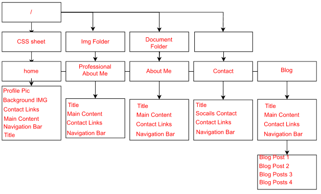
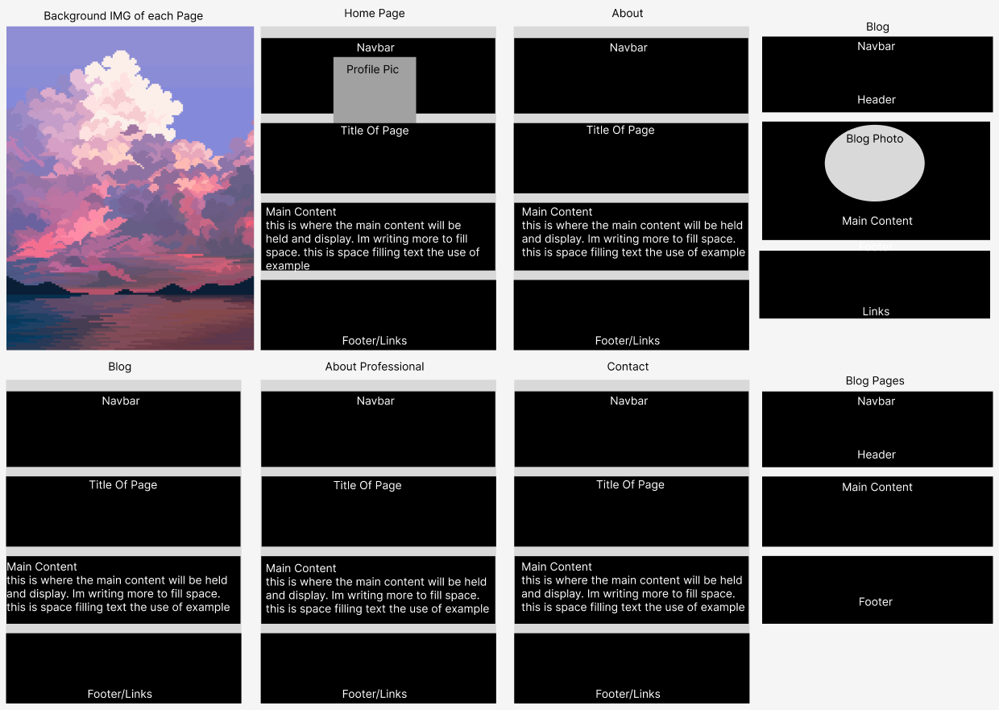

# Mikaere Henare

[https://github.com/Preedie/MikaereHenare_T1A2]()

# My First Webpage Project

My main objective throughout the project is to implement the learnt techniques during the inital phase of my journey to learning how to build a web page.

This particular portfolio project readme will display a site map and wireframe for the personal webpage I built aswell as the basics of how it functions. 
There will also be a list of software used to build it and the intended target audience.

# SITE MAP PICTURE

The following picture illustrates the basic build of my webpage.

# WIREFRAME PICTURE

The following picture illustrates the wireframe build of my web page.
The theme of the web page was "pixelated" even the font and background I chose reflects this. I personally enjoy pixelated images and how basic/minimalistic they can be, so I built the website around that.
the color scheme was chosen as it fit nicely with the overall color scheme of the background image aswell as the fact that I quite like Japanese cherry blossoms which this particular color theme reminds me of.

The pages are completely responsive to mobile and desktop enviroments which will be noticable when or if the user decides to shrink or increase the size of the browser window (in any direction).

# Target Audience

My target audience for the website is employers or team members to see my competency. Also my other classmates for reference or skeleton framework to help design their own content.
Lasty for myself, to read back over to learn from and improve.

# Technical Stack

- HTML markup Language
- CSS for styling and layout
- Draw.io for the Sitemap
- Figma for the Wireframe
- Github For sharing